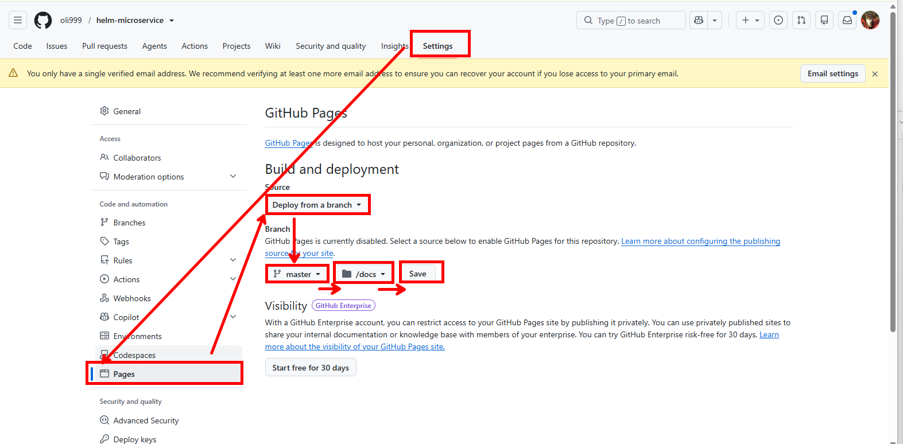

```bash
# chart 를 압축해서 docs/ 폴더 안에 저장하기
helm package . -d docs/
# index.yaml 파일을 docs/ 폴더 안에 자동 생성하기
helm repo index docs --url https://oli999.github.io/helm-microservice/

# add, commit, push 한다
git add .
git commit -m "docs 폴더 구성함"
git push
```

### github pages 가 동작하도록 설정 한다



```bash
# 현재 등록된 helm 저장소 목록 조회
helm repo ls
# 방금 만든 helm chart 의 위치를 helm 저장소로 등록하기
helm repo add msa https://oli999.github.io/helm-microservice/
# 저장소에 있는 내용을 모두 받아올수 있도록 동기화
helm repo update
# 저장소에 어떤 chart 가 들어 있는지 검색
helm search repo msa
msa/msa-platform        0.1.0           1.0.0           index + market + post

# install 해보기
helm install msa-release msa/msa-platform -n msa --create-namespace
```
